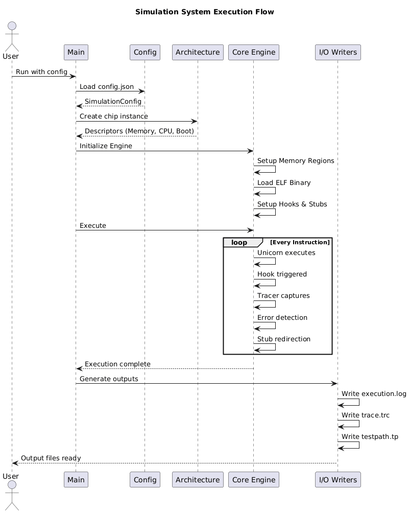
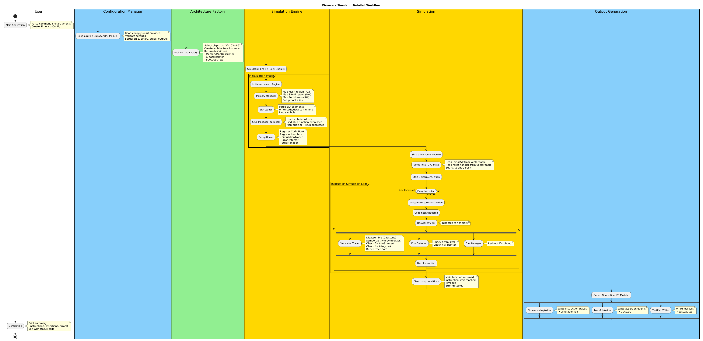

# AKA_Simulator – Chip Simulator 
AKA_Simulator is a chip simulator built on top of the **Unicorn Engine**, currently using AkaUT format for I/O.

## Features
- **Multi-architecture support** - Easy to add new chips (STM32F103, STM32F407...)
- **Instruction-level tracing** - Complete execution trace with source mapping
- **Error detection** - Division by zero, null pointer dereference, stack overflow
- **Assertion tracking** - Capture actual vs expected values from test code
- **Test path generation** - Extract execution paths for test coverage
- **Function stubbing** - Replace functions with stubs for isolated testing
- **Multiple output formats** - JSON traces, execution logs, test paths

---
## Input / Output

### Input
1. **ELF binary** - Compiled firmware with debug symbols (`-g`)
2. **Stub file** *(optional)* - List of functions to stub
3. **Configuration** - Chip selection, (optional) execution limits, (optional) output paths

### Output
1. **Simulation log** (`*.log`) - Instruction-by-instruction trace with source mapping at simulation runtime
2. **Trace file** (`*.trc`) - JSON format with assertion results
3. **Test path** (`*.tp`) - Execution path markers for coverage analysis

---

## Dependencies

### Build Tools
- **CMake** 3.15 or higher
- **C++17** compatible compiler (GCC 7+, Clang 6+)
- **Ninja** or **Make**

### Libraries
- **Unicorn Engine** 2.0+ - CPU emulation
- **Capstone** 4.0+ - Disassembly
- **ELFIO** - ELF parsing
- **nlohmann/json** - JSON handling

### Development Tools
- **llvm-symbolizer** - Source code mapping (LLVM toolchain)
- **Clang** - Cross-compilation for ARM

---

## How to Build  
On **Ubuntu**:  
This script should be changed if you already had ELF file, just comment out the corresponding phase that you have done
```bash
./script.sh
```

## Usuage Examples
1. Basic usage:
```
AKASimulator --chip stm32f103c8t6 --elf <path_to_elf_file>
```

2. With stubs:
```
AKASimulator --chip stm32f103c8t6 --elf <path_to_file_file> --stub <path_to_stub_info_file>
```

3. Custom output files
```
AKASimulator --chip stm32f103c8t6 \
     --elf firmware.elf \
     --log output/my_execution.log \
     --trace output/my_trace.trc \
     --testpath output/my_path.tp
```

4. Custom limits
```
AKASimulator --chip stm32f103c8t6 \
     --elf firmware.elf \
     --limit 500000 \
     --timeout 30000
```

5. Disable features
```
AKASimulator --chip stm32f103c8t6 \
     --elf firmware.elf \
     --no-trace \
     --no-error-detect
```

Any many other combinations of flags, using --help for details

---
## Adding New Chips

### Step 1: Create Chip Descriptor
```cpp
// src/architecture/arm/chips/STM32F103RB.hpp
#pragma once
#include "../ARMCortexM3.hpp"

namespace Simulator {
     namespace ARM {

     class STM32F103RB : public ARMCortexM3Base {
          public:
          std::string getChipName() const override {
               return "stm32f103rb";
          }
          
          std::string getDescription() const override {
               return "STM32F103RB";
          }
          
          MemoryMapDescriptor getMemoryMap() const override {
               MemoryMapDescriptor map;
               
               
               map.addFlash(0x08000000, 128 * 1024);  // 128KB
               map.addSRAM(0x20000000, 20 * 1024);    // 20KB
               
               // Add peripherals...
               // (copy from STM32F103C8T6.hpp)
               
               return map;
          }
          };

     } // namespace ARM
} // namespace Simulator
```

### Step 2: Register
```cpp
// src/architecture/ArchitectureFactory.cpp
#include "architecture/arm/chips/STM32F103RB.hpp"

Result Simulator::registerAllArchitectures() {
    auto& factory = ArchitectureFactory::instance();
    
    factory.registerArchitecture();
    factory.registerArchitecture();
    factory.registerArchitecture();  // ::Success();
}
```


**Adding new chips:** Just implement descriptor - no code changes needed!
---

## Architecture
## Module overview
```
simulator/
├── core/ # All simulation logic
├── architecture/ # Chip architecture metadata
└── io/ # Configuration, file I/O, utilities
```

### Module Details

#### 1. **Architecture Module** (Metadata Only)
Pure metadata definitions - no simulation logic.
```
Architecture Module
├── IArchitecture           # Interface
├── MemoryMapDescriptor     # Flash, SRAM, Peripherals
├── CPUDescriptor           # ISA, Register set
└── Implementations
    └── ARM
        ├── STM32F103C8T6   # Cortex-M3, 128KB Flash, 20KB SRAM
        └── STM32F407VG     # Cortex-M4, 1MB Flash, 192KB SRAM
```

#### 2. **Core Engine Module** (Simulation Logic)
Handles all execution and tracing.
```
Core Module
├── loader/          # ELFLoader - Parse & load binaries
├── memory/          # MemoryManager - Setup memory regions
├── hooks/           # HookDispatcher - Manage Unicorn hooks
├── tracer/          # SimulationTracer - Trace execution
├── errors/          # ErrorDetector - Runtime error detection
├── stubs/           # StubManager - Function stubbing
└── ExecutionEngine  # Orchestrates everything
```

#### 3. **I/O & Utils Module** (File Operations)
Configuration, logging, and output generation.
```
I/O Module
├── config/          # ConfigurationManager
├── logging/         # Console & File loggers
├── writers/         # Output file generators
│   ├── ExecutionLogWriter    → *.log
│   ├── TraceFileWriter       → *.trc (JSON)
│   └── TestPathWriter        → *.tp
└── utils/           # String, File, Symbol resolution
```

---

### I/O & UTILS MODULE
#### Responsibility:
Handle configuration, file I/O, and utilities.
No simulation or execution logic.
#### Components:
- ConfigurationManager — Read and validate config.json
- Logging — Colored console & file logging (Debug → Error)
- Output Writers
- SimulationLogWriter → execution.log
- TraceFileWriter → trace.trc
- TestPathWriter → testpath.tp
- Utilities — String formatting, file helpers, symbolizer wrapper

## Simulation Flow

### High-Level Overview


### Detailed Flow


### Step-by-Step Flow

```
[1] Main Application
     │
     ├─ Parse command line arguments
     └─ Create SimulatorConfig
     │
     ▼
[2] Configuration Manager (I/O Module)
     │
     ├─ Read config.json (if provided)
     ├─ Validate settings
     └─ Setup: chip, binary, stubs, outputs
     │
     ▼
[3] Architecture Factory (Architecture Module)
     │
     ├─ Select chip: "stm32f103c8t6"
     ├─ Create architecture instance
     └─ Return descriptors:
         ├─ MemoryMapDescriptor (Flash: 0x08000000, SRAM: 0x20000000)
         ├─ CPUDescriptor (Cortex-M3, Thumb-2)
         └─ BootDescriptor (Vector table, boot mode)
     │
     ▼
[4] Execution Engine (Core Module)
     │
     ├─ Initialize Unicorn Engine
     │   └─ Map architecture to Unicorn constants
     │
     ├─ Memory Manager
     │   ├─ Map Flash region (RX permissions)
     │   ├─ Map SRAM region (RW permissions)
     │   ├─ Map Peripherals (RW permissions)
     │   └─ Setup boot alias (0x00000000)
     │
     ├─ ELF Loader
     │   ├─ Parse ELF segments
     │   ├─ Write code/data to memory
     │   └─ Find symbols:
     │       ├─ entry_point, main
     │       ├─ AKAS_assert_u32, AKAS_assert_u64
     │       ├─ AKA_mark
     │       └─ AKA_fCall (global variable)
     │
     ├─ Stub Manager (optional)
     │   ├─ Load stub definitions
     │   ├─ Find stub function addresses
     │   └─ Map original → stub addresses
     │
     └─ Setup Hooks
         ├─ Register Code Hook (every instruction)
         ├─ Register handlers:
         │   ├─ SimulationTracer
         │   ├─ ErrorDetector
         │   └─ StubManager
         └─ Install hooks with Unicorn
     │
     ▼
[5] Execution (Core Module)
     │
     ├─ Setup initial CPU state
     │   ├─ Read initial SP from vector table
     │   ├─ Read reset handler from vector table
     │   └─ Set PC to entry point (with Thumb bit)
     │
     └─ Start Unicorn emulation
         │
         ▼
     ┌────────────────────────────────────────────┐
     │  Instruction Execution Loop                │
     │                                            │
     │  [Instruction N at 0x080001XX]             │
     │         │                                  │
     │         ├─ Unicorn executes                │
     │         ├─ Code hook triggered             │
     │         │                                  │
     │         ├─ HookDispatcher                  │
     │         │   └─ Dispatch to handlers        │
     │         │                                  │
     │         ├─ SimulationTracer                │
     │         │   ├─ Disassemble (Capstone)      │
     │         │   ├─ Symbolize (llvm-symbolizer) │
     │         │   ├─ Check for AKAS_assert       │
     │         │   │   └─ Parse caller source     │
     │         │   │       to get var names       │
     │         │   ├─ Check for AKA_mark          │
     │         │   │   └─ Parse comment           │
     │         │   └─ Buffer trace data           │
     │         │                                  │
     │         ├─ ErrorDetector                   │
     │         │   ├─ Check div by zero           │
     │         │   └─ Check null pointer          │
     │         │                                  │
     │         └─ StubManager                     │
     │             └─ Redirect if stubbed         │
     │                                            │
     │  [Next instruction...]                     │
     │                                            │
     └────────────────────────────────────────────┘
         │
         ▼
     Stop conditions:
     ├─ Main function returned
     ├─ Instruction limit reached
     ├─ Timeout
     └─ Error detected
     │
     ▼
[6] Output Generation (I/O Module)
     │
     ├─ ExecutionLogWriter
     │   └─ Write instruction traces → execution.log
     │       Format:
     │       [0x08000100] MOVS R0, #0x42
     │           # CodePos: main.c:42:10 (main)
     │
     ├─ TraceFileWriter
     │   └─ Write assertion events → trace.trc
     │       Format (JSON):
     │       [{
     │         "tag": "Aka function calls: 1",
     │         "actualName": "counter",
     │         "actualVal": "42",
     │         "expectedName": "EXPECTED_counter",
     │         "expectedVal": "42"
     │       }]
     │
     └─ TestPathWriter
         └─ Write markers → testpath.tp
             Format:
             test_start
             condition_true
             loop_iteration_1
     │
     ▼
[7] Completion
     │
     ├─ Print summary (instructions, assertions, errors)
     └─ Exit with status code
```

---

## Hook Processing Detail

### When assertion is called:
```
Source code:
    int counter = 42;
    AKAS_assert_u32(counter, EXPECTED_counter); // Line 43

Execution trace:
    0x08000100: MOV  R0, #42          <- Load counter
    0x08000102: MOV  R1, #42          <- Load expected
    0x08000104: BL   AKAS_assert_u32  <- Call assertion (previous_address)
    0x08001500: [Inside AKAS_assert]  <- Current address (hook triggered)

Hook processing:
    1. Hook triggered at 0x08001500 (inside AKAS_assert_u32)
    2. Use previous_address = 0x08000104 (the BL instruction)
    3. Symbolize 0x08000104 → "main.c:43" (caller location)
    4. Read source line 43: "AKAS_assert_u32(counter, EXPECTED_counter);"
    5. Parse with regex to extract: actual="counter", expected="EXPECTED_counter"
    6. Read R0=42 (actual value), R1=42 (expected value)
    7. Read AKA_fCall global variable (call count)
    8. Store: {
         actualName: "counter",
         actualVal: 42,
         expectedName: "EXPECTED_counter",
         expectedVal: 42,
         fcallCount: 1
       }
```

### When marker is called:
```
Source code:
    AKA_mark();/*lis===13###sois===161###eois===181...*/  // Line 50

Execution:
    0x08000200: BL   AKA_mark         <- previous_address
    0x08001600: [Inside AKA_mark]     <- current_address (hook)

Hook processing:
    1. Hook triggered at 0x08001600
    2. Use previous_address = 0x08000200
    3. Symbolize 0x08000200 → "main.c:50"
    4. Read line 50: "AKA_mark();/*lis===13###sois===161###eois===181...*/"
    5. Parse comment: "lis===13###sois===161###eois===181...*"
    6. Store marker: "lis===13###sois===161###eois===181...*"
```

---